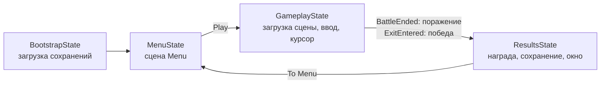
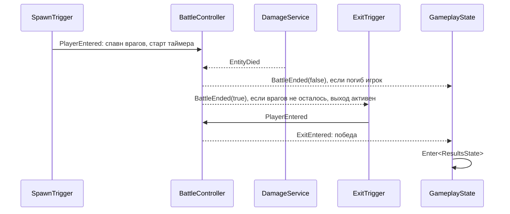

# Primitive Violence

Тестовое задание «Разработчик игровых систем». Арена от первого лица: игрок заходит в зону, появляются враги. Когда все враги убиты, открывается выход, и бой засчитывается как победа после того, как игрок до него дойдёт. Если здоровье игрока падает до нуля, это поражение. После боя показывается экран результатов со статистикой и наградой, затем игрок возвращается в меню, где видно накопленные ресурсы.

Играть в браузере: https://muirehe.github.io/TestProject/

Видео прохождения: [[Media/gameplay.mp4](https://github.com/user-attachments/assets/2224d8fb-c8df-40d4-a1e7-d67e3e1267f6)](https://github.com/user-attachments/assets/2224d8fb-c8df-40d4-a1e7-d67e3e1267f6)

## Запуск

Unity 6000.5.10f1, URP. Открыть сцену `Assets/Game/Scenes/Boot.unity` и нажать Play. Сцены `Boot`, `Menu` и `Gameplay` уже добавлены в Build Settings.

## Управление

| Действие | Клавиша |
|---|---|
| Движение | WASD |
| Обзор | Мышь |
| Спринт | Left Shift |
| Прыжок | Space |
| Базовая атака | ЛКМ |
| Способность 1 (Dash) | Q |
| Способность 2 (AoE) | E |

## Стек

| Библиотека | Для чего |
|---|---|
| VContainer | DI, скоупы Root и Gameplay, entry points |
| MessagePipe | События между системами: урон, смерть, конец боя |
| UniTask | Асинхронная загрузка сцен с отменой |
| MessagePack | Сериализация сохранений |
| Input System | Ввод через сгенерированный класс `GameInput` |

## Структура проекта

```
Assets/Game/Scripts
├── Bootstrap        LifetimeScope: Root (глобальный), Gameplay (сцена боя), Menu
├── Infrastructure   не знает про игру
│   ├── GameStateMachine   машина состояний и состояния
│   ├── ConfigSystem       загрузка ScriptableObject-конфигов
│   ├── SaveSystem         SaveService и IModule
│   ├── SceneSystem        асинхронная загрузка сцен
│   └── Input              сгенерированный GameInput
├── Configs          ScriptableObject, только данные
├── Gameplay         логика без MonoBehaviour
│   ├── Combat             Unit, DamageService, шаги урона, модификаторы, сообщения
│   ├── Player             PlayerModel
│   └── Statistics         сбор статистики боя
├── Meta             данные между сессиями: GameSession, ResourceModule
├── Presentation     MonoBehaviour: игрок, враги, способности, уровень, UI, окна
└── Utils

Assets/Resources
├── Configs          все конфиги, их загружает ConfigProvider
└── Prefabs          окна, их загружает WindowManager
```

## Архитектура

### Скоупы DI

`RootLifetimeScope` живёт всю сессию, начиная со сцены `Boot`. В нём лежат инфраструктура (`SceneLoader`, `GameInput`, `ConfigProvider`, `SaveService`), мета (`GameSession`, `ResourceModule`), брокеры сообщений, машина состояний и `WindowManager`.

`GameplayLifetimeScope` это дочерний скоуп сцены боя. В нём всё, что зависит от объектов сцены: `PlayerModel`, `DamageService`, `BattleController`, `BattleStatisticsService` и исполнители способностей. Скоуп уничтожается вместе со сценой, и его сервисы отписываются сами.

Из боя в мету данные попадают только через `GameSession` из Root: результат, статистика, награда. Поэтому окну результатов и меню не нужен доступ к геймплейному скоупу.

### Машина состояний



Каждое состояние реализует `IState` с методами `Enter` и `Exit`. Машина берёт состояние из контейнера в момент перехода, поэтому между машиной и состояниями нет циклической зависимости.

Состояния только управляют переходами: грузят сцену, показывают и скрывают окна, включают ввод, подписываются на события. Всё, что состояние создало в `Enter`, оно убирает в `Exit`. Загрузка сцены отменяется через `CancellationToken`. Экран загрузки сделан окном (`LoadingWindow` реализует `IProgress<float>`), а не отдельным состоянием.

### Игровой цикл и события



Системы не знают друг о друге и общаются через MessagePipe: `DamageApplied`, `EntityDied`, `AbilityUsed`, `BattleEnded`, `ExitEntered`. Например, на урон одновременно подписаны статистика, полоски здоровья и контроллер боя.

Враги спавнятся по бюджету силы из `LevelConfig.EnemyMight`. Тип врага выбирается случайно с учётом веса (`Weight`), у каждого типа своя стоимость `Might`, спавн идёт, пока бюджет не исчерпан.

### Здоровье и урон

`Unit` это общая модель игрока и врагов: конфиг, здоровье, статы, кулдауны способностей. На сцене `UnitView` связывает GameObject с его `Unit`.

Весь урон проходит через `DamageService.TryDealDamage(source, target, damage)`. Внутри урон по очереди обрабатывают шаги `IDamageStep`, у всех общий `DamageContext`:

1. `DamageModifierStep` применяет модификаторы урона атакующего.
2. `CritStep` считает шанс и множитель крита из оружия.
3. `ArmorStep` учитывает броню цели (доля от 0 до 1).

После этого урон ограничивается оставшимся здоровьем, применяется, и публикуются `DamageApplied` и `EntityDied`. Новый эффект (уклонение, щит, уязвимость) добавляется новым шагом, атаки и способности менять не нужно.

Статы и модификаторы. `Unit.Get(StatType)` берёт базовое значение из конфига юнита или оружия и применяет к нему `ModifierConfig`: сначала абсолютные (`Abs`), потом процентные (`Pct`). `Unit.Modify(value, StatType)` применяет модификаторы к любому значению, например к кулдауну способности.

### Способности

Базовая атака тоже считается способностью: `WeaponConfig` наследует `AbilityConfig`. Поэтому у атаки, Dash и AoE общий механизм кулдаунов, время готовности хранится в `Unit`.

В конфиге только данные. Логику выполняет исполнитель `AbilityExecutor<TConfig>`, его выбирают по типу конфига:

| Конфиг | Исполнитель | Что делает |
|---|---|---|
| `WeaponConfig` | `MeleeAttackExecutor` | Луч из точки прицела, препятствия блокируют удар |
| `DashAbilityConfig` | `DashExecutor` | Рывок по направлению движения |
| `AoeAbilityConfig` | `AoeExecutor` | Урон всем целям в радиусе и визуальный эффект |

Исполнители регистрируются в `GameplayLifetimeScope` как `IAbilityExecutor`, а `AbilityController` собирает из них словарь «тип конфига: исполнитель». Чтобы добавить способность, нужны новый конфиг, новый исполнитель и одна строка регистрации.

`AbilityController` общий для всех. Наследники задают только отличия: по каким слоям бить (`TargetMask`), направление, точку прицела и когда применять.

- `PlayerAbilityController` применяет способности по нажатию клавиш и целится из камеры.
- `EnemyAbilityController` атакует, когда подошёл на дистанцию удара, а остальные способности применяет, как только они готовы.

### ИИ врагов

ИИ максимально простой, как просит ТЗ. `EnemyMoveController` поворачивает врага к игроку и ведёт его до дистанции атаки, `EnemyAbilityController` атакует и применяет способности. Когда игрок погибает, враги останавливаются.

Типы врагов:
- Melee: ближний бой и Dash;
- AoeMelee: ближний бой, Dash и AoE.

### Статистика

`BattleStatisticsService` из скоупа Gameplay подписан на `DamageApplied` и `EntityDied` и записывает в `GameSession.BattleStats`:
- сколько врагов убито;
- сколько урона нанесено;
- сколько урона получено;
- время боя от входа в арену до конца боя (его фиксирует `BattleController`).

### Награда

`ResultsState` один раз за бой вызывает `ResourceModule.AddResourcesFromBattle` и сохраняет прогресс. Формулу для монет и опыта настраивают отдельно в `EconomyStatisticConfig`:

```
награда = База + ЗаУбийство * убийства + ЗаУрон * урон + бонусы
```

При победе добавляются два бонуса:
- за скорость: полный, если бой уложился в `ParTime`, дальше линейно уменьшается до нуля;
- за сохранённое здоровье: тем больше, чем меньше урона получено.

При поражении бонусов нет, а итог умножается на `LoseMultiplier`.

### Сохранения

`IModule` это интерфейс модуля сохранения с методами `ReadData`, `ApplyData`, `Save` и `Reset`. `ModuleBase<TData>` хранит данные и пишет их в `persistentDataPath/<TData>.msgpack` через MessagePack.

`SaveService` получает из контейнера все `IModule`. Загрузка происходит в `BootstrapState`, сохранение после подсчёта награды. `ResourceModule` хранит монеты и опыт между запусками, меню показывает их на старте.

Чтобы добавить сохраняемые данные, достаточно унаследоваться от `ModuleBase<T>` и зарегистрировать класс через `.As<IModule>()`. Если файл сохранения повреждён, игра не падает: модуль начинает с пустых данных и пишет ошибку в лог.

В WebGL `persistentDataPath` лежит в IndexedDB браузера, и записанные файлы попадают туда только после `FS.syncfs`. Поэтому после сохранения `SaveService` вызывает функцию из `Assets/Game/Plugins/WebGL/FileSync.jslib`.

### Конфиги

Все параметры лежат в ScriptableObject в `Resources/Configs`. `ConfigProvider` загружает их один раз и отдаёт двумя способами:
- одиночные (`ISingleDefinition`): `PlayerConfig`, `PlayerMovementSettings`, `EconomyStatisticConfig`;
- по Id (`IDefinitionById`): уровни, враги, оружие, способности, модификаторы.

### UI

`WindowManager` создаётся в Root и не уничтожается при смене сцен. Он находит префабы окон в `Resources/Prefabs` по типу и внедряет в них зависимости. Окна: `LoadingWindow` и `ResultsWindow` (победа или поражение, статистика, награда).

HUD боя (`HUD`, `HealthView`, `AbilitiesView`) лежит в сцене Gameplay. Он получает `PlayerModel` через DI и обновляется по событиям.

## Что упрощено

- Нет NavMesh и Behavior Tree, враги идут к игроку напрямую, как разрешает ТЗ.
- Нет пула объектов: врагов и эффектов немного.
- Модификаторы статичные, берутся из конфига юнита. Временных баффов нет.
- Уровень один. Он передаётся через `GameSession.LevelConfig`, так что выбор уровня можно добавить, не трогая бой.
- Вся графика собрана из примитивов.
